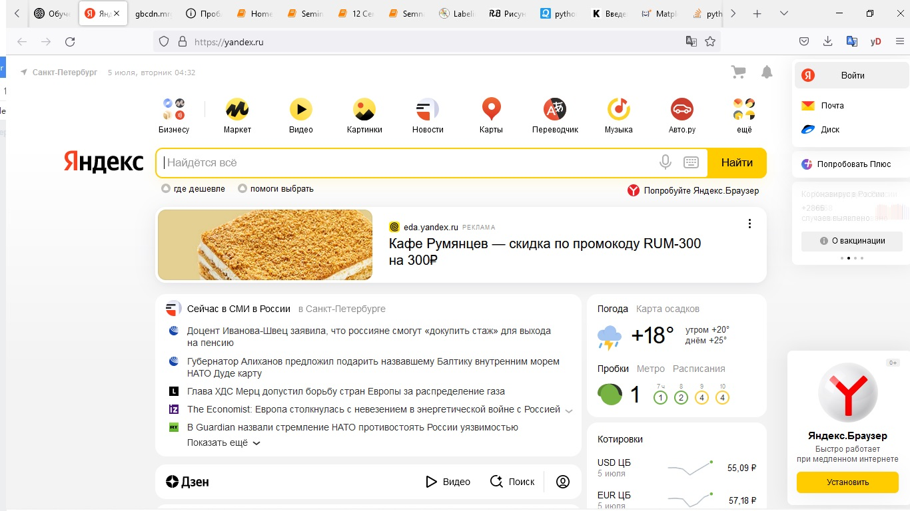
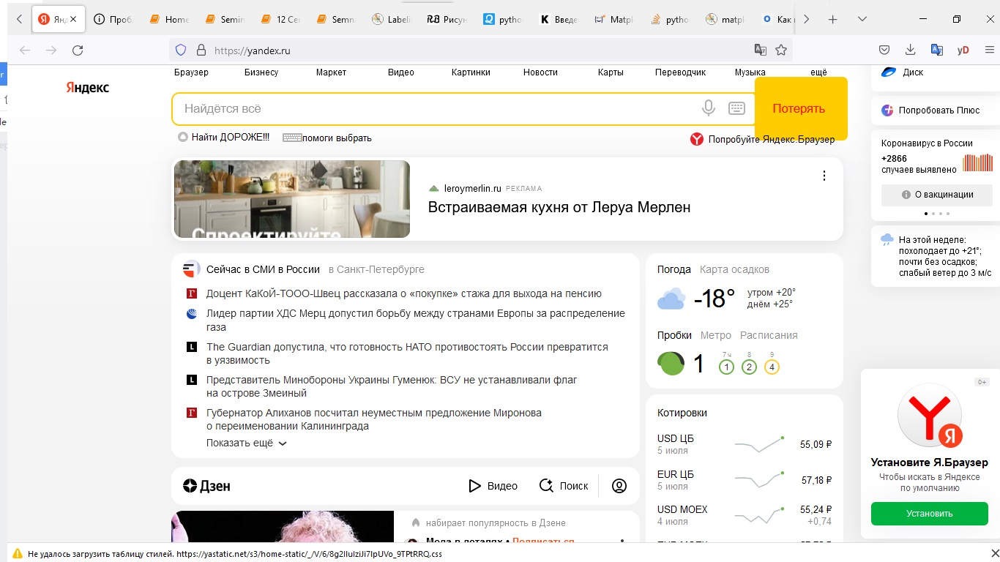
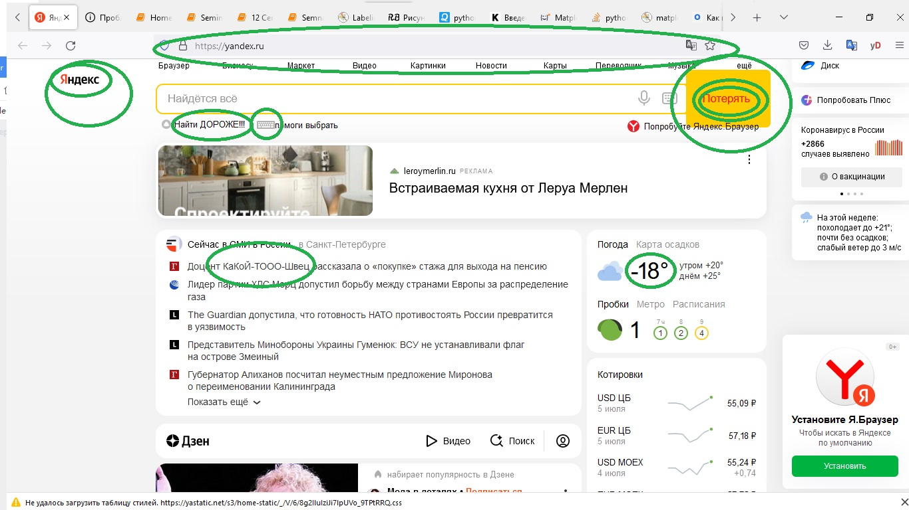

## Домашнее задание по предмету 
# **Знакомство с веб-технологиями**
## 1 семинар

### Задача: на основе сайта yandex.ru:

    - Определите, на каком протоколе работает сайт. (yandex.ru)
    - Проанализируйте структуру страницы сайта. (yandex.ru)
    - Внесите не менее 10 изменений на страницу с помощью инструмента разработчика и представьте скриншоты было/стало. (yandex.ru)
    - Создайте прототип низкой детализации (дополнительное задание, если на семинаре дошли до задания №8, за основу можно выбрать любой сайт). Webstorm IDE
  
***

1. Сайт работает на протоколе https 
2. Не очень понимаю структуру. Точнее трудно выделить определённые зоны, кроме "подвала". Маленький подвал в самом низу страницы. Заголовком назвал бы саму строку ввода поиска. Остальное - в основном зона контента вперемежку с виджетами рекламы.
3. Было 
Стало 
И отмаркированные изменения 
Десятое изменение пропало на скрине. Заметил поздно. Прошу поверить - изменил прозрачность верхней линейки виджетов до почти чёрных значков).